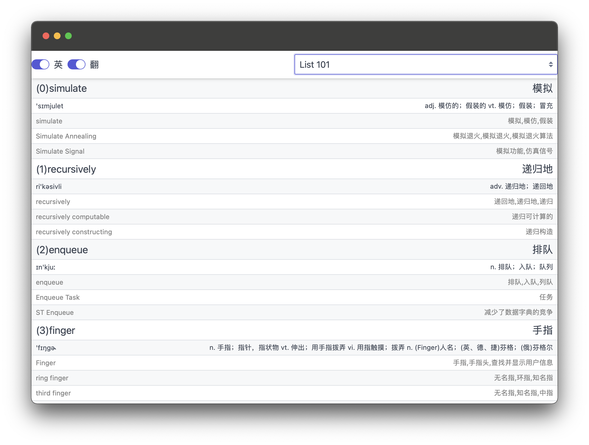
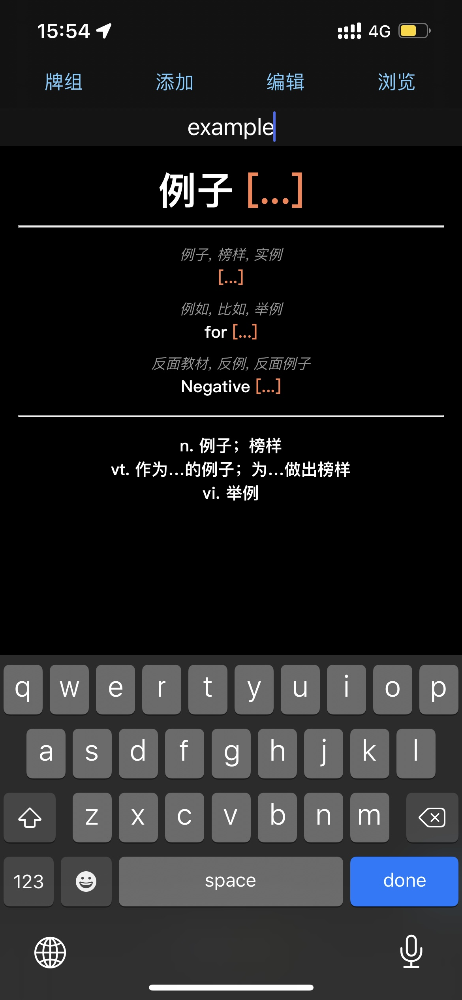
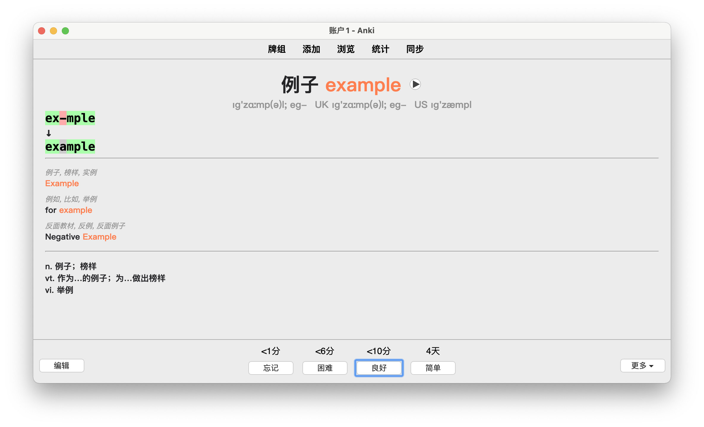

# docs2word(自用型)

📖 将文档导按词频提取出单词，然后背背背 😂 

数据来源(2017-5) 主流前端库文档、MDN 文档、Stackoverflow 3000 问、Github TOP 100 > Issues TOP 100。

## 怎么用？

使用纸笔：在线的单词表 [words.hsuan.xyz](https://words.hsuan.xyz)

    

或者使用 [Anki](https://apps.ankiweb.net/)：在 [release](https://github.com/hsuanxyz/docs2word/releases) 中下载 apkg 文件（包含带发音文件的包）并导入。

    
    

